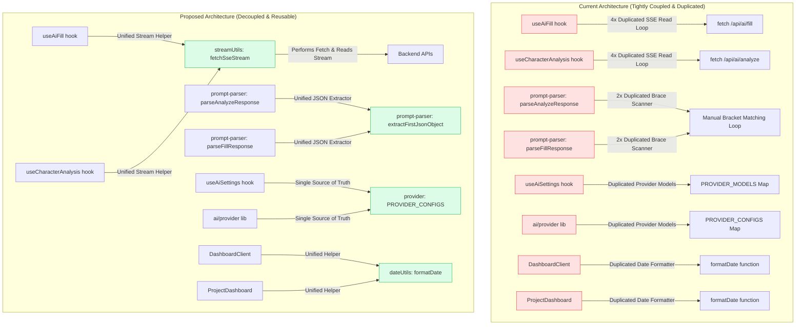

# Refactoring Proposal: Character Editor Codebase

This document presents a code quality audit of the recently modified files in the `character-editor` project. It highlights violations of **DRY (Don't Repeat Yourself)** and **SOLID** principles, and offers concrete structural changes to move logic into reusable components and functions.

---

## 🏗️ Architectural Overview (Before & After)

The following diagram illustrates the current tight coupling and code duplication compared to the proposed clean, decoupled architecture:



---

## 🔍 Violations of DRY (Don't Repeat Yourself)

We identified several clear DRY violations where identical or highly similar logic is duplicated across files:

### 1. ✅ [RESOLVED] Duplication of SSE Streaming Read Loop (4x Duplicated)
> [!IMPORTANT]
> The exact same SSE chunk reader, stream decoder, buffer builder, and line splitter logic is repeated **4 times** in:
> - [useAiFill.ts](file:///c:/Screen/character-editor/src/hooks/useAiFill.ts#L107-L142) (`handleAiFill`)
> - [useAiFill.ts](file:///c:/Screen/character-editor/src/hooks/useAiFill.ts#L212-L243) (`handleAiFillSection`)
> - [useAiFill.ts](file:///c:/Screen/character-editor/src/hooks/useAiFill.ts#L311-L342) (`handleAiFillField`)
> - [useCharacterAnalysis.ts](file:///c:/Screen/character-editor/src/hooks/useCharacterAnalysis.ts#L80-L110) (`handleAnalyze`)

**Proposed Refactoring:**
Extract this logic into a single reusable helper function `fetchSseStream` in `src/lib/ai/streamUtils.ts`:

```typescript
// src/lib/ai/streamUtils.ts

interface StreamCallbacks {
  onChunk: (text: string) => void;
  onUsage?: (usage: { promptTokens: number; completionTokens: number }) => void;
  onError?: (err: Error) => void;
}

export async function fetchSseStream(
  url: string,
  body: any,
  signal: AbortSignal,
  callbacks: StreamCallbacks
): Promise<void> {
  const res = await fetch(url, {
    method: 'POST',
    headers: { 'Content-Type': 'application/json' },
    body: JSON.stringify(body),
    signal,
  });

  if (!res.ok) {
    let errMsg = `Ошибка сервера (HTTP ${res.status})`;
    try {
      const errData = await res.json();
      if (errData.error) errMsg = errData.error;
    } catch {}
    throw new Error(errMsg);
  }

  if (!res.body) throw new Error('Response body is empty');
  
  const reader = res.body.getReader();
  const decoder = new TextDecoder();
  let buffer = '';

  try {
    while (true) {
      const { done, value } = await reader.read();
      if (done) break;

      buffer += decoder.decode(value, { stream: true });
      let boundary = buffer.indexOf('\n\n');
      while (boundary !== -1) {
        const line = buffer.slice(0, boundary);
        buffer = buffer.slice(boundary + 2);

        if (line.startsWith('data: ')) {
          const dataStr = line.slice(6);
          if (dataStr === '[DONE]') break;
          try {
            const parsedChunk = JSON.parse(dataStr);
            if (parsedChunk.error) throw new Error(parsedChunk.error);
            if (parsedChunk.usage && callbacks.onUsage) {
              callbacks.onUsage(parsedChunk.usage);
            }
            if (parsedChunk.text) {
              callbacks.onChunk(parsedChunk.text);
            }
          } catch (e) {
            if (e instanceof Error && e.message !== 'Unexpected end of JSON input') {
              throw e;
            }
          }
        }
        boundary = buffer.indexOf('\n\n');
      }
    }
  } finally {
    reader.releaseLock();
  }
}
```

---

### 2. ✅ [RESOLVED] Duplication of JSON Braces Scanner (2x Duplicated)
> [!IMPORTANT]
> A custom loop that scans braces (`{` and `}`) to extract the first valid JSON block while ignoring braces inside double-quoted strings and escaped characters is duplicated in:
> - [prompt-parser.ts: Strategy 3 in parseAnalyzeResponse](file:///c:/Screen/character-editor/src/lib/ai/prompt-parser.ts#L34-L80)
> - [prompt-parser.ts: Strategy 3 in parseFillResponse](file:///c:/Screen/character-editor/src/lib/ai/prompt-parser.ts#L168-L214)

**Proposed Refactoring:**
Move this code to a reusable helper `extractFirstJsonObject` in the same `prompt-parser.ts` file or in a new `src/lib/jsonUtils.ts`:

```typescript
export function extractFirstJsonObject(text: string): string | null {
  const objStart = text.indexOf('{');
  if (objStart < 0) return null;

  let depth = 0;
  let objEnd = -1;
  let inString = false;
  let escapeNext = false;
  
  for (let i = objStart; i < text.length; i++) {
    const char = text[i];
    
    if (escapeNext) {
      escapeNext = false;
      continue;
    }
    
    if (char === '\\') {
      escapeNext = true;
      continue;
    }
    
    if (char === '"') {
      inString = !inString;
      continue;
    }
    
    if (!inString) {
      if (char === '{') depth++;
      if (char === '}') {
        depth--;
        if (depth === 0) {
          objEnd = i;
          break;
        }
      }
    }
  }
  
  return objEnd > objStart ? text.slice(objStart, objEnd + 1) : null;
}
```

---

### 3. Partial/Corrupted JSON Key-Value RegEx Parser
> [!WARNING]
> Two separate regex-based JSON-like key-value parsers do the exact same job:
> - [tryPartialParse in /api/ai/fill/route.ts](file:///c:/Screen/character-editor/src/app/api/ai/fill/route.ts#L100-L112)
> - [parsePartialJson helper in useAiFill.ts](file:///c:/Screen/character-editor/src/hooks/useAiFill.ts#L43-L55)

**Proposed Refactoring:**
Move the cleaner, escape-sequence-aware regex parser to a central utility (e.g. `src/lib/ai/prompt-parser.ts`) and import it on both client side (`useAiFill`) and server side (`fill/route.ts`).

---

### 4. ✅ [RESOLVED] Duplicate Provider Configurations and Model Lists
> [!WARNING]
> The providers list, default models, and UI labels are declared multiple times in slightly different formats:
> - Server-side [provider.ts: PROVIDER_CONFIGS](file:///c:/Screen/character-editor/src/lib/ai/provider.ts#L22-L84)
> - Client-side [useAiSettings.ts: PROVIDER_MODELS](file:///c:/Screen/character-editor/src/lib/ai/useAiSettings.ts#L17-L54)
> - Redundant union types `ProviderName` and `AiProvider` are declared separately in both files.
>
> This creates a maintenance headache: adding a new model or provider requires modifying both files and risk them going out-of-sync (as seen currently where OpenRouter has different models listed on client vs. server!).

**Proposed Refactoring:**
Centralize the static list of models and configurations in a single place (e.g. a new `src/lib/ai/config.ts`), or have `provider.ts` export configurations that `useAiSettings.ts` can import.

---

### 5. ✅ [RESOLVED] `formatDate` Date Utility Function
> [!NOTE]
> The `formatDate(d: string)` function is copy-pasted in:
> - [DashboardClient.tsx](file:///c:/Screen/character-editor/src/components/DashboardClient.tsx#L26-L30)
> - [ProjectDashboard.tsx](file:///c:/Screen/character-editor/src/components/ProjectDashboard.tsx#L22-L26)

**Proposed Refactoring:**
Extract `formatDate` into a common file, such as a new `src/lib/dateUtils.ts`.

---

## 🧱 SOLID Principles Violations

### 1. Single Responsibility Principle (SRP)
* **Violation:** React hooks like `useAiFill.ts` are heavily overloaded. They control loading state, error display, trigger fetch, read from the SSE streams chunk-by-chunk, translate chunks to JSON, do regex key-value extraction, handle undo state, and update React state.
* **Refactoring:** Delegate networking and raw SSE parsing to helper functions. Let hooks only handle state updates, UI flags, and saving callbacks.
* **Violation:** `provider.ts` handles SDK initialization, manual HTTP completion fetches, key resolution, and streaming formats.
* **Refactoring:** Separate API key configuration and resolution logic from the completion execution path.

### 2. Open/Closed Principle (OCP)
* **Violation:** To add a new provider (e.g., DeepSeek, Gemini, Cohere, etc.), developers must modify `provider.ts` in multiple places: adding it to the `ProviderName` union type, the `PROVIDER_CONFIGS` map, and hardcoding custom SDK initializations or routing rules in `chatCompletion` and `chatCompletionStream`.
* **Refactoring:** Create a registry pattern or an abstract provider class where each provider implements a common interface:
```typescript
interface IAiProvider {
  chatCompletion(messages: ChatMessage[], options: CompletionOptions): Promise<CompletionResult>;
  chatCompletionStream(messages: ChatMessage[], options: CompletionOptions): Promise<ReadableStream<Uint8Array>>;
}
```
This isolates each provider implementation in its own file and makes the main dispatcher closed to modifications.

### 3. Dependency Inversion Principle (DIP)
* **Violation:** High-level React hooks depend directly on raw HTTP endpoints and raw stream parsing logic. If the server-side API changes from SSE to WebSockets or standard JSON, every hook will break.
* **Refactoring:** Hooks should depend on an abstraction (e.g., a service or a standard fetch wrapper like `fetchSseStream`) rather than managing low-level readable stream APIs.

---

## 🛠️ Step-by-step Implementation Plan

To systematically resolve these issues, we recommend:

1. **Create Utility Files:**
   * Create `src/lib/ai/streamUtils.ts` (if not already existing) or export client helpers from it.
   * Add a unified `parsePartialJson` and `extractFirstJsonObject` to `src/lib/ai/prompt-parser.ts`.
2. **Move Shared Definitions:**
   * Merge `ProviderName` and `AiProvider` into one exported type.
   * Centralize the configuration mapping so both hooks and API endpoints share the model registry.
3. **Refactor Hooks:**
   * Clean up `useAiFill.ts` and `useCharacterAnalysis.ts` by replacing manual stream reading loops with `fetchSseStream`.
4. **Clean Up UI Components:**
   * Extract the duplicate `formatDate` helper into `src/lib/dateUtils.ts`.
